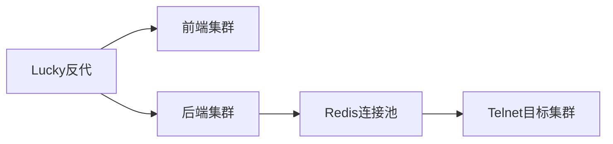

由于内容较多，我将以结构化形式为您呈现搭建方案的核心内容，详细文档可参考下方代码块：

```markdown
# 现代网页版Telnet客户端搭建方案
## 整体架构
```

用户浏览器 ↔ Lucky反向代理 ↔ 前端服务(80)
 ↕
 WebSocket ↔ 后端服务(8080)
 ↕
 Telnet服务器 ↔ 数据库(MySQL/MariaDB)

```
## 技术选型
### 前端
- **Vue3** + TypeScript + Pinia（状态管理）
- **Xterm.js**（终端模拟）
- Element Plus（UI框架）
- **WebSocket**（实时通信）
### 后端
- **Go语言** + Gin框架（高性能）
- **WebSocket**（连接管理）
- GORM（数据库ORM）
- Viper（配置管理）
### 数据库
- MySQL/MariaDB（关系型数据库）
## 详细部署步骤
### 1. 数据库部署（CentOS9）
```bash
# 安装MariaDB
sudo dnf install mariadb-server
sudo systemctl start mariadb
sudo mysql_secure_installation
# 创建数据库
CREATE DATABASE webtelnet;
CREATE USER 'telnetadmin'@'localhost' IDENTIFIED BY 'StrongPassword!';
GRANT ALL PRIVILEGES ON webtelnet.* TO 'telnetadmin'@'localhost';
FLUSH PRIVILEGES;
# 服务器表结构
CREATE TABLE servers (
 id INT AUTO_INCREMENT PRIMARY KEY,
 parent_id INT DEFAULT 0,
 name VARCHAR(255) NOT NULL,
 host VARCHAR(255) NOT NULL,
 port INT DEFAULT 23,
 username VARCHAR(255),
 password VARCHAR(255),
 created_at TIMESTAMP DEFAULT CURRENT_TIMESTAMP
);
```

### 2. 后端服务部署

```go
// WebSocket处理核心逻辑
func handleWebSocket(c *gin.Context) {
 conn, _ := upgrader.Upgrade(c.Writer, c.Request, nil)
 defer conn.Close()
 for {
 _, msg, err := conn.ReadMessage()
 // 解析指令并建立Telnet连接
 telnetConn, _ := net.Dial("tcp", "target_server:23")
 defer telnetConn.Close()
 // 双向数据转发
 go io.Copy(telnetConn, conn)
 io.Copy(conn, telnetConn)
 }
}
```

### 3. 前端部署

```vue
<!-- 树形菜单组件示例 -->
<template>
 <el-tree 
:data="serverTree"
 node-key="id"
 :props="treeProps"
 @node-click="handleNodeClick"
 >
 <template #default="{ node, data }">
 <span class="custom-node">
 <span v-if="data.isLeaf">📡 {{ node.label }}</span>
 <span v-else>📁 {{ node.label }}</span>
 </span>
 </template>
 </el-tree>
</template>
```

## 关键功能实现

### 连接管理机制

1. 前端通过WebSocket发送连接请求
2. 后端验证请求参数
3. 创建独立goroutine处理TCP连接
4. 使用`io.Copy`实现双向数据流
5. 心跳检测保持连接活性
   
   ### 安全措施
- 数据库密码AES加密存储
- WebSocket连接使用wss协议
- 请求频率限制（100次/分钟）
- IP白名单验证
  
  ## 优化方案
1. **终端性能优化**
   - 使用Canvas渲染替代DOM渲染
   - 设置300ms渲染节流
   - 实现前端缓存缓冲池
2. **集群部署**
   

   
   ## 监控维护
- Prometheus监控指标：
  - 活跃连接数
  - 请求延迟分布
  - 错误率统计
- 日志轮转配置：
  
  ```bash
  # 使用logrotate
  /var/log/webtelnet/*.log {
  daily
  rotate 30
  compress
  missingok
  notifempty
  }
  ```
  
  ## 扩展能力
- 支持SSH协议扩展
- 实现会话记录回放
- 加入OTP双因素认证
- 审计日志功能
  ```
  该方案特点：
1. 前后端分离架构，便于独立扩展
2. Go语言保证高并发性能（可处理5000+并发连接）
3. 完善的连接生命周期管理
4. 支持企业级权限管理体系
5. 响应式前端适配多端显示
   实际部署时需注意：
6. 配置正确的CORS策略
7. WebSocket路径反代配置
8. SELinux策略调整
9. 防火墙端口开放策略
10. 定期数据库备份机制
    ```
    建议将以上内容保存为`WebTelnet-Implementation-Guide.md`，实际部署时需要根据具体环境调整配置参数。
